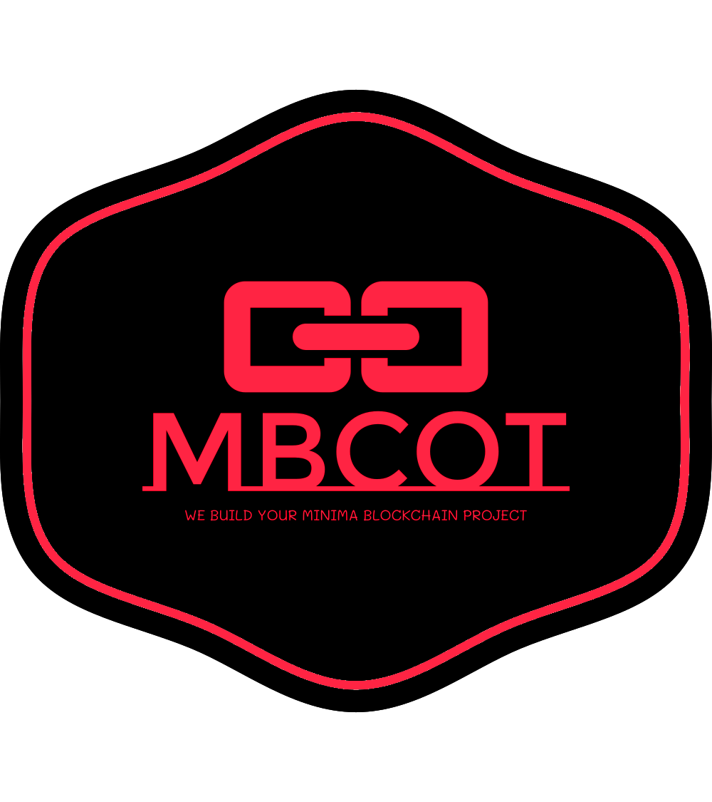
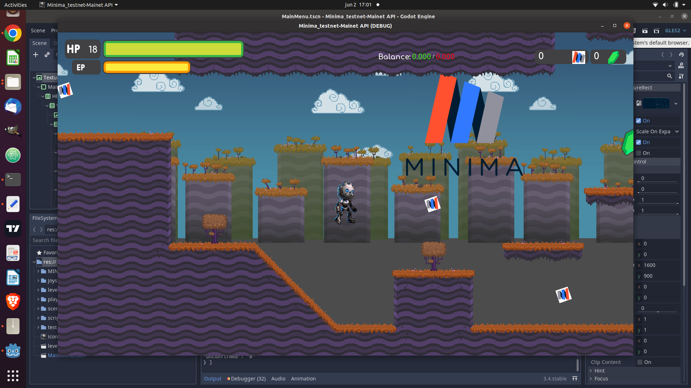
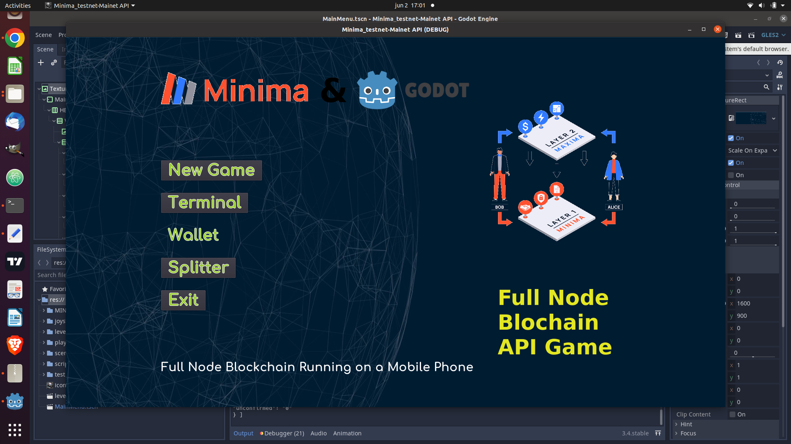
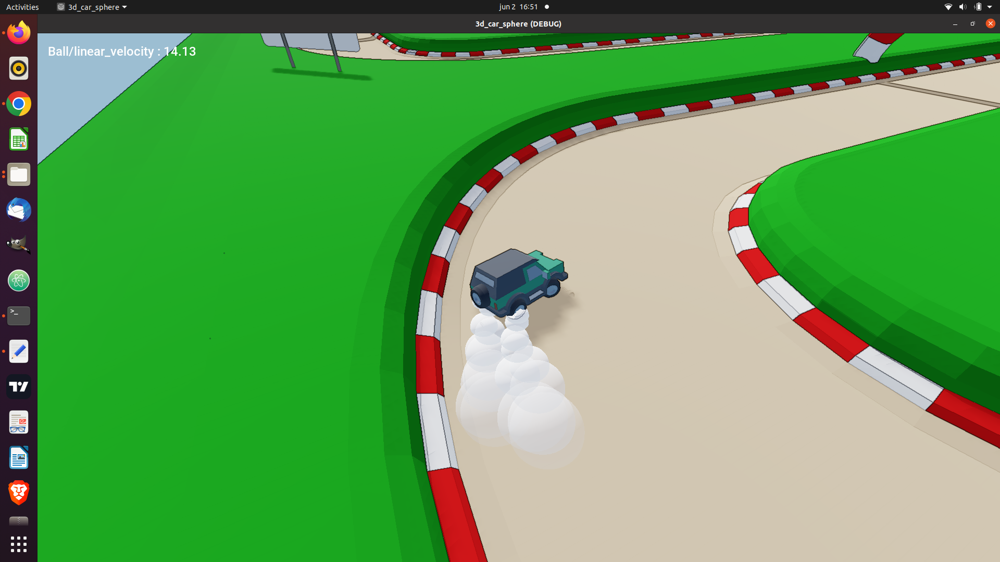
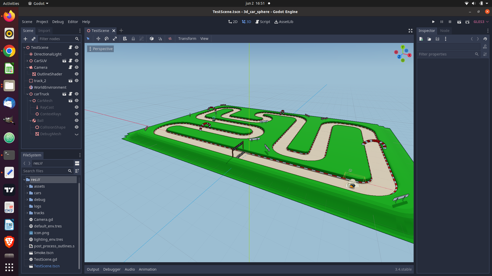
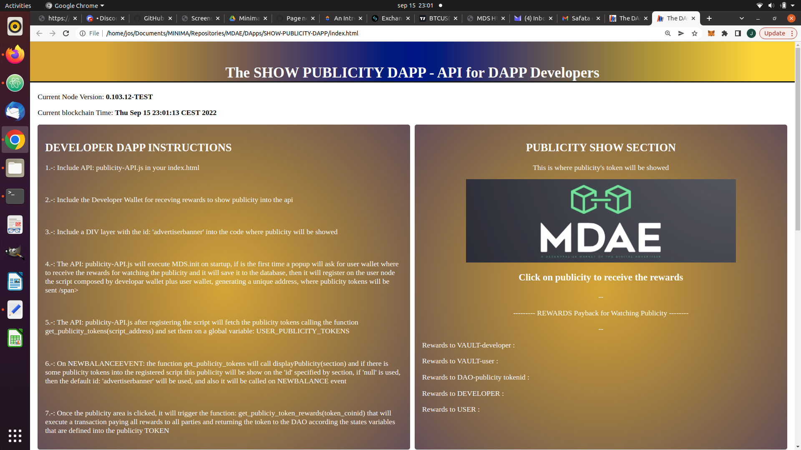
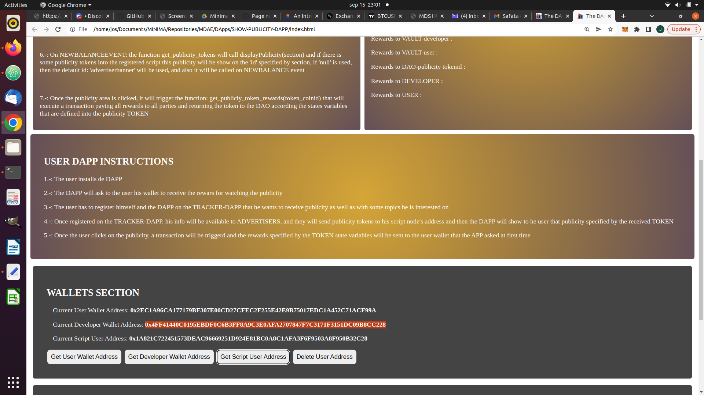

# Godot-Minima-API 
**A Godot - Minima API integration that let you build any game integrated on your minima node**

  

- **GODOT-MINIMA API**
  - An API that let you integrate GODOT Engine Game into minima node. 
  - Do any **2d / 3d / single player / multiplayer game** that can interact directly with your minima node !!!
  - So that it open a lot of possiblilities
    - Play to earn.
    - Generate tokens on certain events of the game.
    - Buy tokens that represent players, weapons, building.
    - Dynamic publicity integrated into the game, only receiving a token to a specific address or
      contract of the minima node that the game is tracking and would get its info to post on the game or on any object of the game.
    - Receiving real data streams that the game could represent as points, objects,
      (maybe real race track GPS cars positions)...
  
- **STATUS of the API**
  - It works, it can use any minima command so can do any transaction or interaction with the node, the tokens and the coins.
  - The publicity part needs an overview
  - The events capture need to find a way to capture the minima events, meanwhile pulling balance works well.
  - The code need to be refactored as there is on it a lot of direrent options aproached mixed and its need to be clean and improve some things.
  - So any game can be developed and can interact with a minima node like on any dapp does, openening a huge new innovative games any sectors but specially on the play to earn, due to the faciliy for minima to deal with tokens and the game to interact with the API.
  - A new Proof of concept is being built to demonstrate the capabilities of mixing a game with a minima node.
- **Images**
  - 
    
    
    
    
    
 
